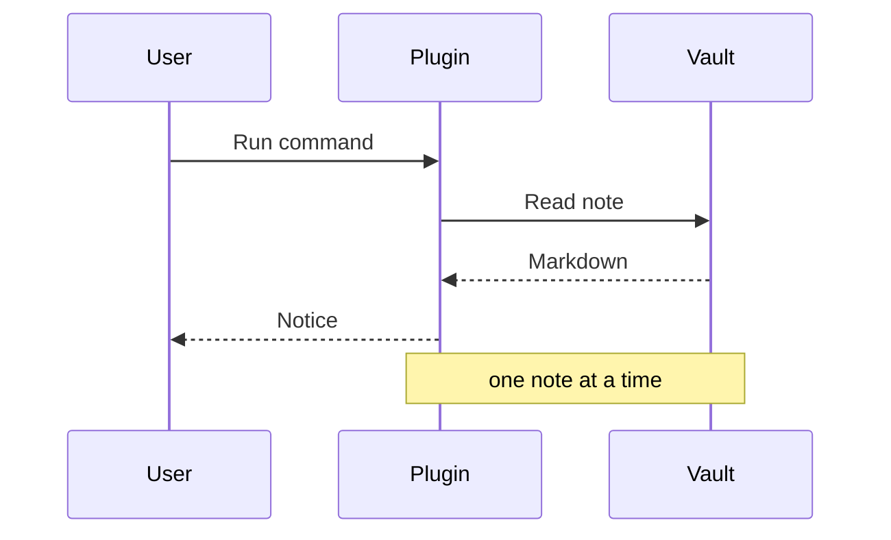

# Mermaid: sequenceDiagram

図の種類: `sequenceDiagram`

```mermaid
sequenceDiagram
    participant U as User
    participant P as Plugin
    participant V as Vault
    U->>P: Run command
    P->>V: Read note
    V-->>P: Markdown
    P-->>U: Notice
    Note over P,V: one note at a time
```
