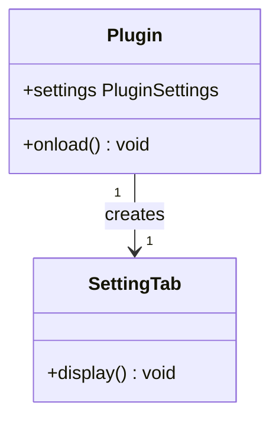

# Mermaid: classDiagram

図の種類: `classDiagram`

```mermaid
classDiagram
    class Plugin {
        +settings PluginSettings
        +onload() void
    }
    class SettingTab {
        +display() void
    }
    Plugin "1" --> "1" SettingTab : creates
```
