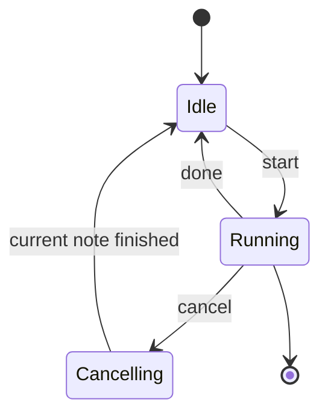

# Mermaid: stateDiagram-v2

図の種類: `stateDiagram-v2`

```mermaid
stateDiagram-v2
    [*] --> Idle
    Idle --> Running : start
    Running --> Idle : done
    Running --> Cancelling : cancel
    Cancelling --> Idle : current note finished
    Running --> [*]
```
