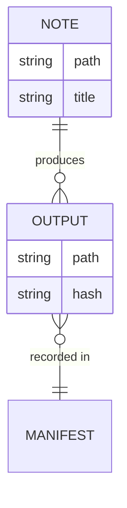

# Mermaid: erDiagram

図の種類: `erDiagram`

```mermaid
erDiagram
    NOTE ||--o{ OUTPUT : produces
    OUTPUT }o--|| MANIFEST : "recorded in"
    NOTE {
        string path
        string title
    }
    OUTPUT {
        string path
        string hash
    }
```
