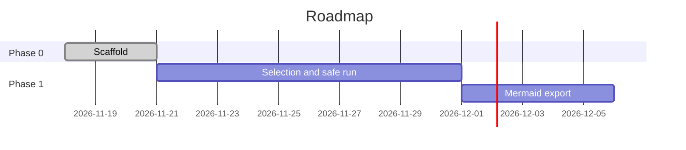

# Mermaid: gantt

図の種類: `gantt`

```mermaid
gantt
    title Roadmap
    dateFormat YYYY-MM-DD
    section Phase 0
    Scaffold :done, p0, 2026-11-18, 3d
    section Phase 1
    Selection and safe run :p1, after p0, 10d
    Mermaid export :after p1, 5d
```
