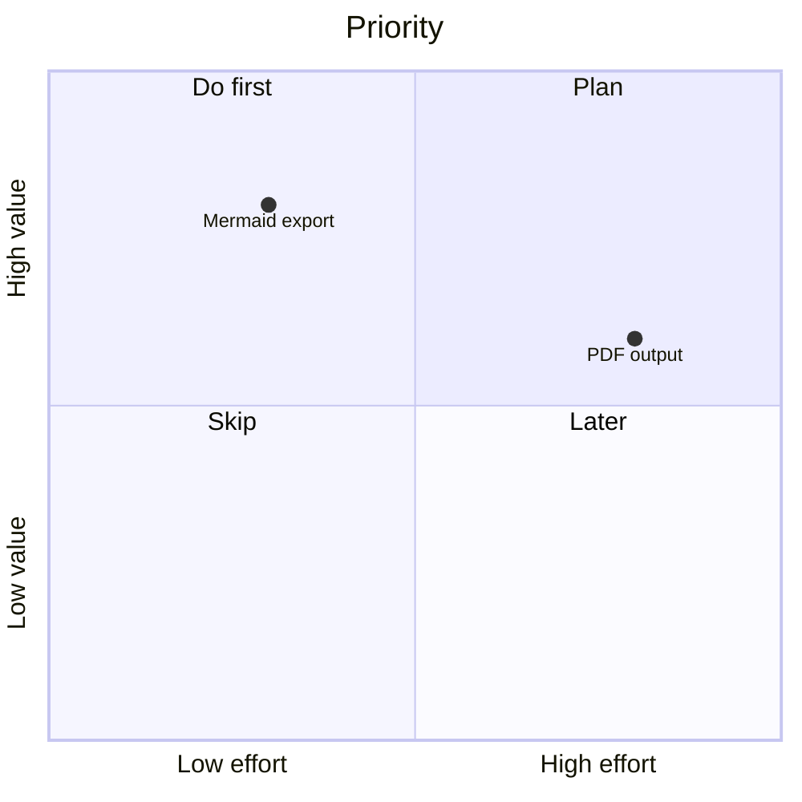

# Mermaid: quadrantChart

図の種類: `quadrantChart`

```mermaid
quadrantChart
    title Priority
    x-axis Low effort --> High effort
    y-axis Low value --> High value
    quadrant-1 Plan
    quadrant-2 Do first
    quadrant-3 Skip
    quadrant-4 Later
    Mermaid export: [0.3, 0.8]
    PDF output: [0.8, 0.6]
```
