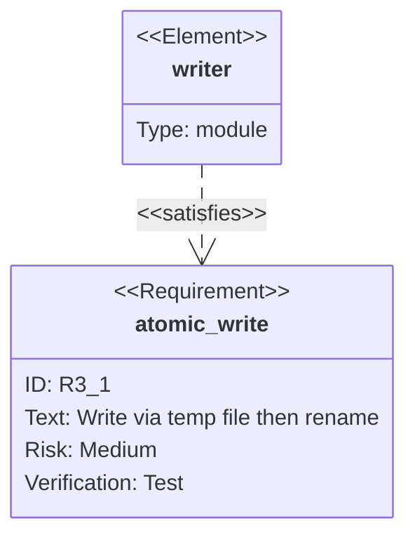

# Mermaid: requirementDiagram

図の種類: `requirementDiagram`

```mermaid
requirementDiagram
    requirement atomic_write {
        id: R3_1
        text: Write via temp file then rename
        risk: medium
        verifymethod: test
    }
    element writer {
        type: module
    }
    writer - satisfies -> atomic_write
```
