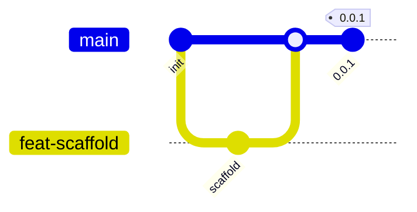

# Mermaid: gitGraph

図の種類: `gitGraph`

```mermaid
gitGraph
    commit id: "init"
    branch feat-scaffold
    checkout feat-scaffold
    commit id: "scaffold"
    checkout main
    merge feat-scaffold
    commit id: "0.0.1" tag: "0.0.1"
```
