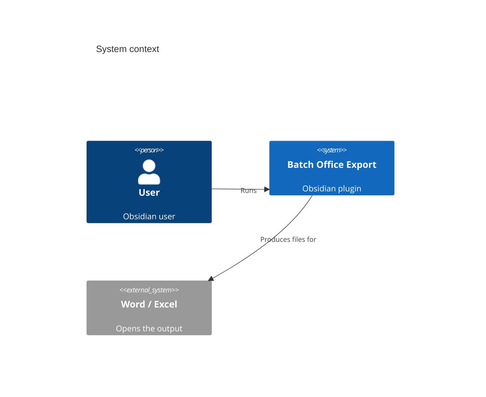

# Mermaid: C4Context

図の種類: `C4Context`

```mermaid
C4Context
    title System context
    Person(user, "User", "Obsidian user")
    System(plugin, "Batch Office Export", "Obsidian plugin")
    System_Ext(word, "Word / Excel", "Opens the output")
    Rel(user, plugin, "Runs")
    Rel(plugin, word, "Produces files for")
```
