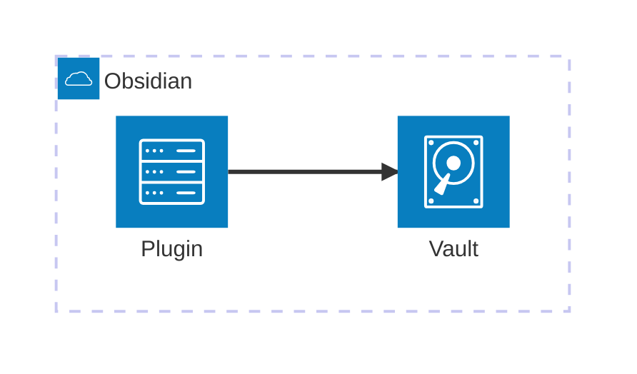

# Mermaid: architecture-beta

図の種類: `architecture-beta`

```mermaid
architecture-beta
    group app(cloud)[Obsidian]
    service plugin(server)[Plugin] in app
    service vault(disk)[Vault] in app
    plugin:R --> L:vault
```
