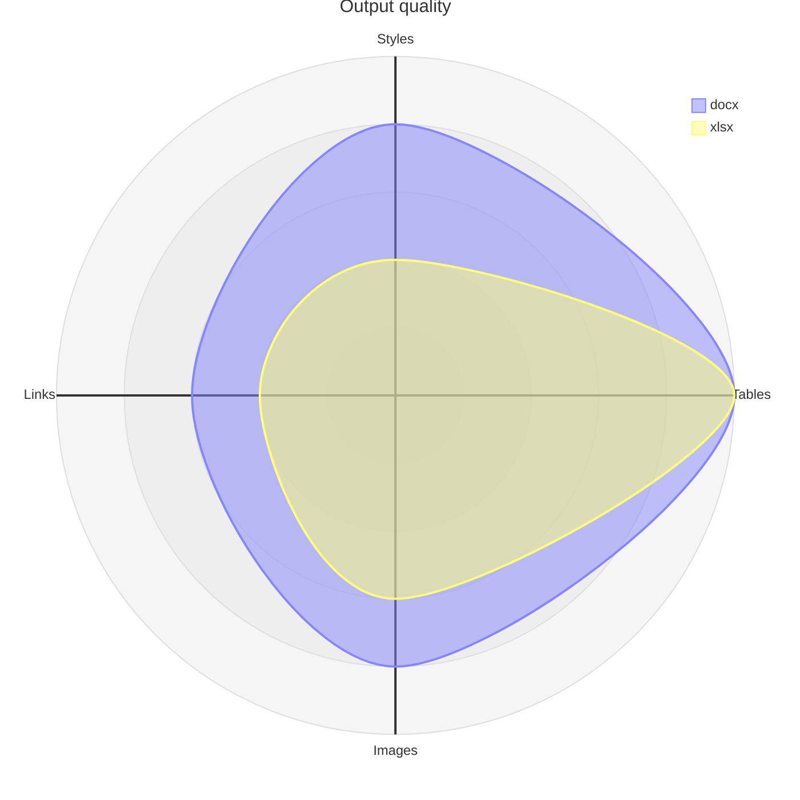

# Mermaid: radar-beta

図の種類: `radar-beta`

```mermaid
radar-beta
    title Output quality
    axis s["Styles"], t["Tables"], i["Images"], l["Links"]
    curve docx["docx"]{4, 5, 4, 3}
    curve xlsx["xlsx"]{2, 5, 3, 2}
```
