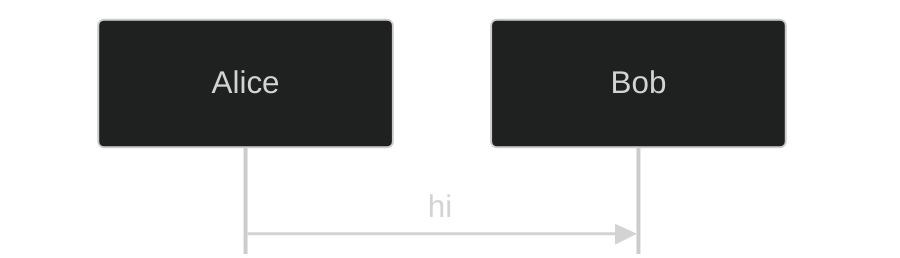

# 利用者のディレクティブがあるノート

利用者が `theme: dark` を指定していても、テーマは neutral になる。`mirrorActors: false` は残る。

```mermaid
%%{init: {'theme': 'dark', 'sequence': {'mirrorActors': false}}}%%
sequenceDiagram
    Alice->>Bob: hi
```
