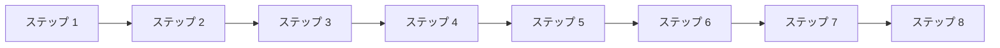
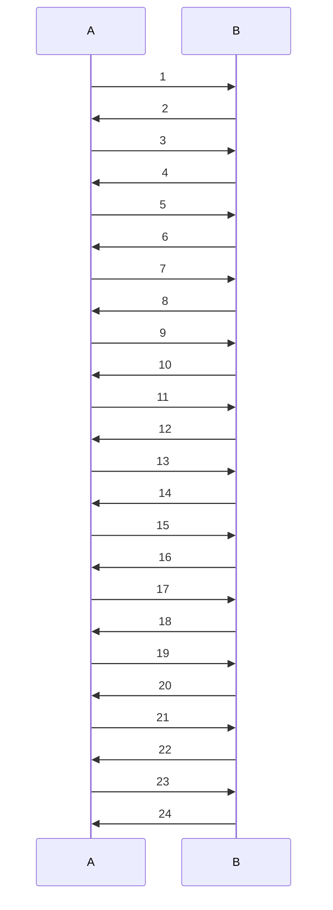

# Mermaid

本文幅に収まる小さな図:

```mermaid
flowchart LR
    A[収集] --> B[確認] --> C[変換]
```

横に長い図（本文幅に縮む）:

```mermaid
flowchart LR
    A1[ステップ 1] --> A2[ステップ 2] --> A3[ステップ 3] --> A4[ステップ 4] --> A5[ステップ 5] --> A6[ステップ 6] --> A7[ステップ 7] --> A8[ステップ 8]
```

縦に長い図（本文の高さに縮む）:

```mermaid
sequenceDiagram
    participant A
    participant B
    A->>B: 1
    B->>A: 2
    A->>B: 3
    B->>A: 4
    A->>B: 5
    B->>A: 6
    A->>B: 7
    B->>A: 8
    A->>B: 9
    B->>A: 10
    A->>B: 11
    B->>A: 12
    A->>B: 13
    B->>A: 14
    A->>B: 15
    B->>A: 16
    A->>B: 17
    B->>A: 18
    A->>B: 19
    B->>A: 20
    A->>B: 21
    B->>A: 22
    A->>B: 23
    B->>A: 24
```

描画に失敗する図（ソースがコードブロックとして残り、警告が出る）:

```mermaid
flowchart TD
    this is not ((( valid
```
