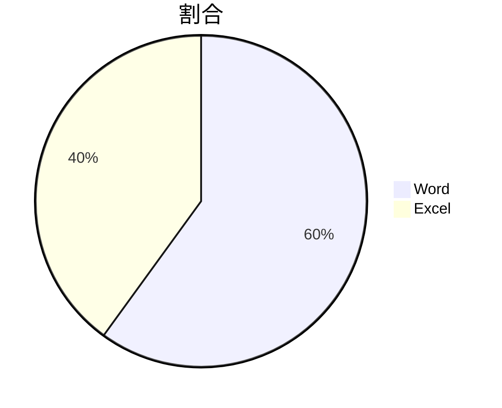

# 全部入りのサンプル

frontmatter は本文に出ない。

## リストと表

1. **太字**の項目
2. ==ハイライト==の項目
   - [x] 完了したタスク

| 項目 | 値 |
|---|--:|
| A | 1 |

## 図とコード


```mermaid
pie title 割合
    "Word" : 60
    "Excel" : 40
```

> 引用

```
plain code
```

---

[リンク](https://obsidian.md)
